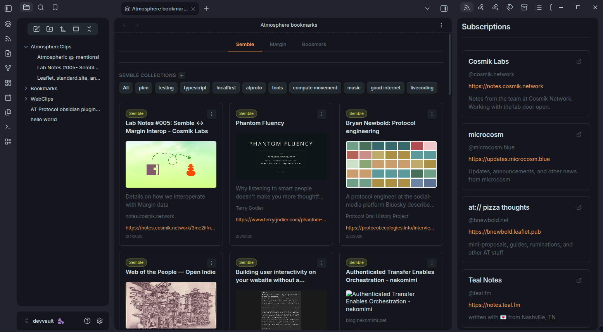
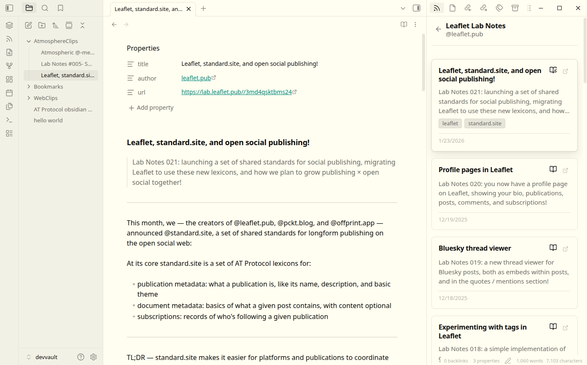

# obsidian-atmosphere

Obsidian plugin for AT Protocol integrations, including bookmarking platforms and standard.site publishing.

Surf the atmosphere from the coziness of your vault.

## Features

### Bookmarking & Knowledge Networks

View and manage bookmarks from AT Protocol platforms:

- [Semble](https://semble.so) (`network.cosmik.*`) - Collections and cards with notes
- [Margin](https://margin.at) (`at.margin.*`) - Bookmarks with collections and tags
-  [Kipclip](https://kipclip.com) and community bookmarks (`community.lexicon.bookmarks.*`) - Community bookmarks lexicon (supports kipclip tags)

### Publishing & Reading

- **Publish documents** - Publish Obsidian notes to [standard.site](https://standard.site/) publications like [leaflet.pub](https://leaflet.pub) and [pckt.blog](https://pckt.blog)
- **Blog feed** - Browse and clip documents from subscribed standard.site publications to your vault

## Installation

Official release in Obsidian plugin directory is under review. For now, install with BRAT:

1. Install the [BRAT plugin](https://github.com/TfTHacker/obsidian42-brat) from Community Plugins
2. Open BRAT settings
3. Click "Add Beta plugin"
4. Enter: `https://github.com/treethought/obsidian-atmosphere`
5. Enable the plugin in Community Plugins

## Setup

### Authentication

1. Open Settings > Atmosphere
2. Enter your AT Protocol handle (e.g., `user.bsky.social`)
3. Create an app password at [bsky.app/settings/app-passwords](https://bsky.app/settings/app-passwords)
4. Enter the app password
5. Save settings

## Commands

| Command | Description |
|---------|-------------|
| **Open bookmarks** | Opens the bookmarks view showing items from Semble, margin.at, and bookmarks lexicon |
| **Publish document** | Publishes the active note to a standard.site publication |

Access commands via the command palette (Ctrl/Cmd + P) or ribbon icons.

## Settings

| Setting | Description | Default |
|---------|-------------|---------|
| **Handle** | Your AT Protocol handle or DID (e.g., `user.bsky.social`) | - |
| **App password** | App password from bluesky settings | - |
| **Clip directory** | Directory in your vault where clipped documents are saved | `AtmosphereClips` |

## Usage

### Browsing Bookmarks

Switch between sources (Semble, Margin, Bookmarks) and filter by collections or tags. Supports adding cards to collections and creating collections collections, tags, and notes (for Semble).

### Publishing Documents

Open a note and run "Publish document" command. After selecting one of your existing standard.site publication, your note will be converted to the applicable format (for leaflet or pckt), published, and update your note's properties with publication url, AT uris, etc.

### Reading & Clipping

Opening the feed will present your standard.site publications. Click a publication to view it's published documents to either view in browser or clip to your vault. 

## Supported Rich Content Formats

- **Leaflet** - Rich blog posts with markdown support
- **Pckt** - Lightweight blogging format

## Network Use

This plugin connects to AT Protocol services to fetch and manage your bookmarks.
